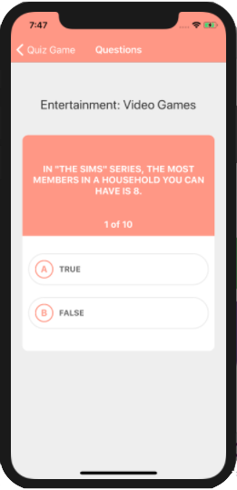
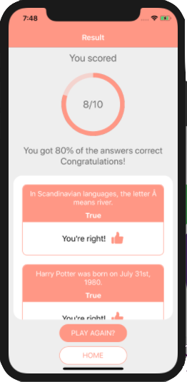

## Quiz Game

[](https://circleci.com/gh/gustavoferreirads/quiz-game/tree/master)

###About

This is a quiz game mobile application with 10 True or False questions. 
In the end you can see the result as score.

#### Mobile  
  
    

### Available Scripts

In the project directory, you can run:

### `yarn start`

Runs the app in the development mode, with expo and ios emulator.<br>
The view will reload if you make edits.<br>

### `yarn test`

Launches the test runner in the interactive watch mode.<br>
See the section about

### `yarn run lint`
Run validations,  automatically fix problems and format code


### Table of contents
[Project structure](#project-structure)

[Installation](#installation)

[Configuration](#configuration)

[Technologies used](#technologies-used)

### Project structure

````
|- App.js____________________________________ # Application entry
src/                                         
|- components/                                # Sienge generic components
|    |- Answer/                                
|       |- index.js __________________________ # Common answer button
|       |- styles.js _________________________ # Css modules styles
|    |- Button/                                # Common button
|    |- Container/                             # General Container
|    |- Loading/                               # Quiz loading
|- redux/
|    |- actions/
|       |- index.js __________________________ # Actions to quiz game
|    |- reducers/                                             
       |- quiz.js ____________________________ # Main redux to quiz game                                  
|    |- index.js _____________________________ # Config redux
|- screens/                                   
|    |- Home/ 
|       |- index.js __________________________ # Initial screen from app
|       |- styles.js _________________________ # Css modules styles
|    |- Quiz/                                  # Screen for questions
|    |- Result/                                # Result of the quiz
|- services/                                  
|-   |- http.js _____________________________ # Axios request generic config
|- styles/  
     |- routeService.js _____________________ # Route generator application init
|- __tests__/                                 # All tests
|-   |- ... _________________________________ # Same files structure
|- __mocks__/                                 # Override css libs
|    |- axios________________________________ # Mock request for test
|    |- redux-mock-store_____________________ # Mock redux store for test

````


### Installation

1- Clone the 

`git clone https://github.com/gustavoferreirads/quiz-game`

2- `yarn` to install npm packages

3- start dev server using `yarn start`

4- Unit testing will watch all your changes in the test files as well as create coverage folder for you. 
`yarn test`


### Configuration
* Babel config `/babel-setup.js`
* Eslint config `/.eslintrc`


#### Technologies used

* [React-Native](https://facebook.github.io/react-native/)
* [Redux](https://redux.js.org/) [ For to manager app state ]
* [Redux-thunk](https://github.com/reduxjs/redux-thunk) [ For write async logic that interacts with the store. ]
* [Redux-promise](https://github.com/redux-utilities/redux-promise)  [Middleware function. If it receives a promise, it will dispatch the resolved value of the promise]
* [Babel 7](https://github.com/babel/babel) [ Transforming JSX and ES6,ES7,ES8 ]
* [Jest](https://github.com/facebook/jest) [ Unit test]
* [Enzyme](http://airbnb.io/enzyme/) [For UI testing.]
* [Eslint](https://github.com/eslint/eslint/) [with airbnb config]
* [Prettier](https://github.com/prettier/prettier) [ Code formatter ]
* [Axios](https://github.com/css-modules/css-modules) [ Isolated style based on each component ]
* [React-navigation](https://reactnavigation.org/)

By João Gustavo Ferreira dos Santos
